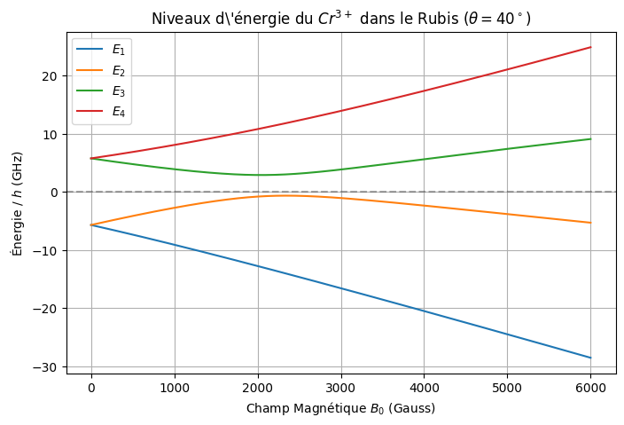
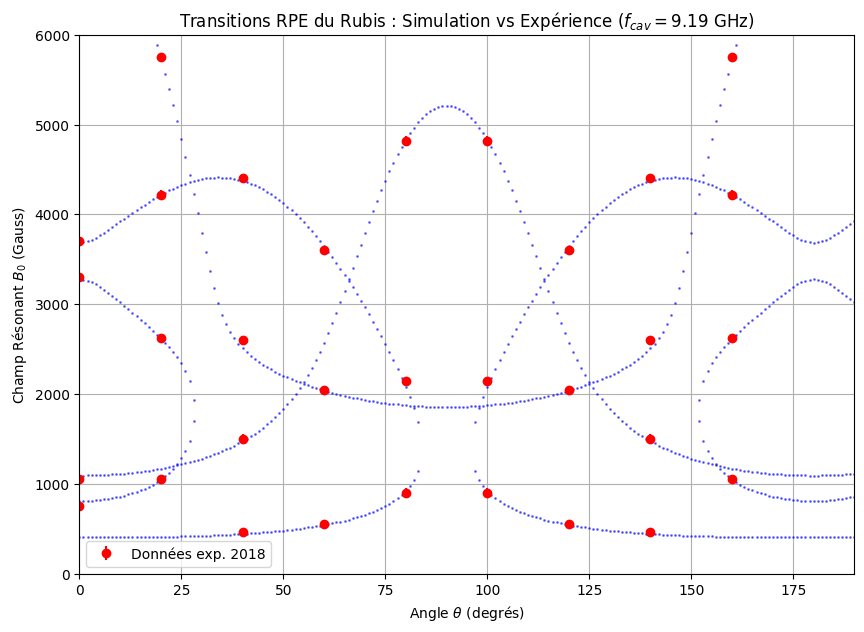
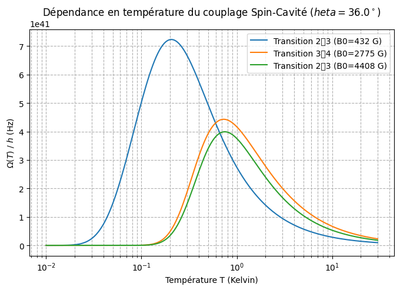
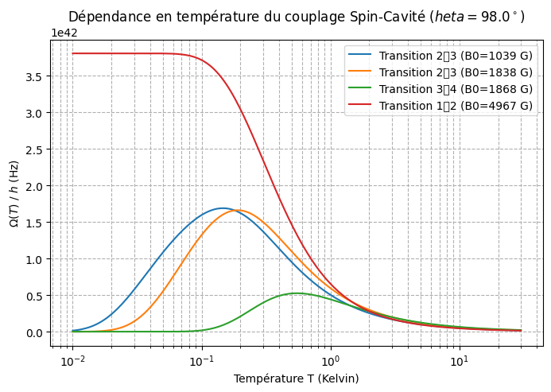

# TP numérique de Physique Quantique — RPE dans le rubis

**Résonance Paramagnétique Électronique de l'ion Cr³⁺ dans le rubis**

Elias Bonnefoi — ESPCI Paris PSL, 1ère année (2025-2026)

Ce TP numérique modélise et interprète des mesures de Résonance Paramagnétique Électronique
(RPE) réalisées sur un monocristal de rubis (Al₂O₃ dopé Cr³⁺), en couplant diagonalisation
numérique d'un hamiltonien de spin et confrontation directe à des données expérimentales
mesurées en 2018 sur ce même système.

## Contenu

- [`rapport.pdf`](rapport.pdf) — rapport complet du TP
- [`simulation_rpe_rubis.py`](simulation_rpe_rubis.py) — code Python de simulation

## Le système physique

L'ion Cr³⁺ dans le rubis se comporte comme un spin effectif `S = 3/2` soumis à un champ
cristallin axial (le champ électrique local créé par les atomes d'oxygène voisins) et à
l'effet Zeeman d'un champ magnétique externe `B₀`. L'hamiltonien de spin s'écrit :

```
H/h = D·(Sz² − S²/3) + (g_e·μ_B·B0/h)·(cos θ·Sz + sin θ·Sx)
```

avec `D = 5,73 GHz` (constante de champ cristallin) et `θ` l'angle entre `B₀` et l'axe
cristallin `c` du rubis. Un échantillon est placé dans une cavité micro-onde de fréquence
fixe `f_cav = 9,19 GHz`, et on cherche les couples `(θ, B₀)` pour lesquels l'écart entre deux
niveaux d'énergie du Cr³⁺ correspond exactement à `f_cav` — c'est-à-dire les résonances RPE.

## 1. Niveaux d'énergie et transitions (à θ fixé)

La matrice `4×4` de `H` est diagonalisée numériquement (`numpy.linalg.eigh`) pour chaque
`(B₀, θ)`. À `θ = 0°`, l'hamiltonien est diagonal dans la base `|mₛ⟩` (`B₀ ∥` axe `c`) ; dès
que `θ ≠ 0`, le terme `Sx·sinθ` mélange les états et impose la diagonalisation numérique.



*Niveaux d'énergie des 4 états propres en fonction de `B₀`, pour `θ = 40°`. La ligne
pointillée marque `f_cav`. On observe des évitements de croisement (anticrossing) entre
niveaux de même symétrie — signature du mélange introduit par `θ ≠ 0`.*

En comptant les croisements avec `f_cav`, on trouve **4 transitions RPE visibles** à
`θ = 40°`. Cette multiplicité (contre une seule transition pour un spin-1/2 usuel comme le
DPPH) est une conséquence directe du spin `S = 3/2` du chrome : il existe `C(4,2) = 6` paires
de niveaux possibles, dont le nombre effectivement résonant dépend de l'angle et du champ
disponible.

## 2. Carte des transitions RPE dans le plan (θ, B₀)

En balayant `θ ∈ [0°, 190°]` et `B₀ ∈ [0, 6000]` G, on identifie toutes les paires de niveaux
en résonance avec la cavité, ce qui trace une carte complète des positions de résonance.



*Carte des transitions RPE : champ de résonance `B₀` en fonction de l'angle `θ`. Points bleus
= simulation numérique. Croix rouges = données expérimentales mesurées lors des TP 2018
(Table 1 du rapport).*

**L'accord entre simulation et données expérimentales est excellent**, ce qui valide
à la fois la valeur `D = 5,73 GHz` et la pertinence du modèle de spin effectif `S = 3/2` avec
champ cristallin axial pour décrire l'ion Cr³⁺ dans le rubis. Certaines branches disparaissent
à `θ = 60°` et `80°` car les transitions correspondantes sortent de la fenêtre de champ
accessible `[0, 6000]` G.

## 3. Couplage spin-cavité Ω(T)

Pour un échantillon de volume `1 mm³` dopé à 0,1 % en Cr³⁺, on estime le nombre de spins :

```
N = 0,001 × 2 × ρ·V·N_A / M(Al2O3) ≈ 4,7 × 10¹⁶ spins
```

Ce grand nombre justifie un traitement collectif : le couplage spin-cavité s'amplifie en
`Ω ∝ √N` (renforcement de Dicke). La force de couplage à une transition dépend aussi de la
polarisation thermique de Boltzmann entre les deux niveaux impliqués :

```
Ω(T)/2π = (g_e·μ_B·b₁ / 2h) · |⟨E_a|Ŝy|E_b⟩| · √(N·|p_ab(T)|)
```

où `p_ab(T)` est la différence de population normalisée entre les deux niveaux à l'équilibre
thermique (distribution de Boltzmann).



*Couplage spin-cavité `Ω(T)/2π` pour les 3 transitions observables à `θ = 36°`.*



*Même tracé pour `θ = 98°` — un nombre et une amplitude de transitions différents, car les
éléments de matrice `⟨Ea|Ŝy|Eb⟩` dépendent des vecteurs propres, qui changent avec l'angle.*

Le comportement en température est universel : à haute `T`, la polarisation décroît en
`1/√T` (loi de Curie) et le couplage diminue avec elle ; à basse `T` (`k_BT ≪ ΔE`), le spin
sature dans son état fondamental et `Ω` atteint un plateau. Les transitions entre niveaux
proches en énergie saturent à plus basse température que celles entre niveaux éloignés.
Les ordres de grandeur obtenus, `Ω/2π ~ 1-10 MHz` pour un champ micro-onde `b₁ = 100 pT`,
sont comparables aux couplages mesurés dans les expériences réelles de qubits hybrides
spin-circuit supraconducteur — ce TP reproduit donc, à l'échelle d'une simulation, un système
pertinent pour les architectures de mémoires quantiques hybrides.

## Dépendances

```bash
pip install numpy matplotlib scipy
```

## Exécution

```bash
python simulation_rpe_rubis.py
```
